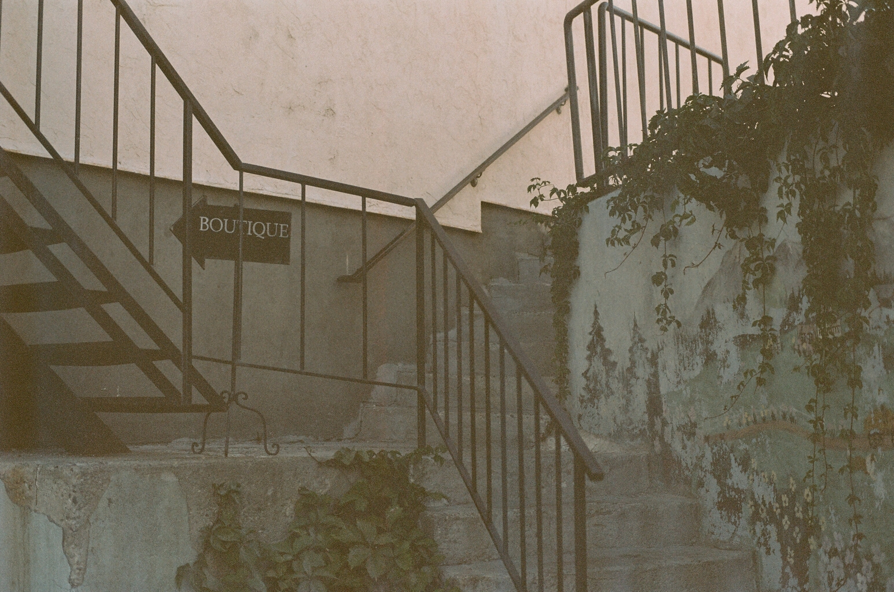
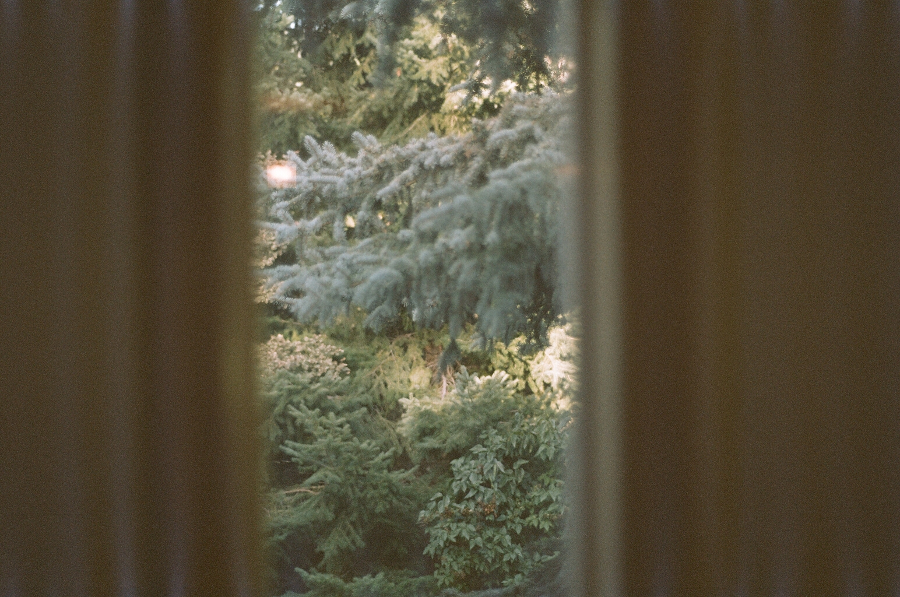
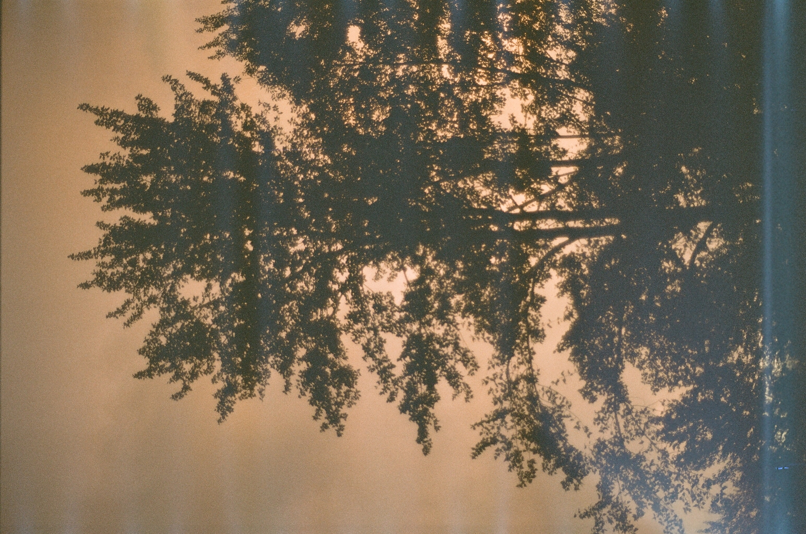
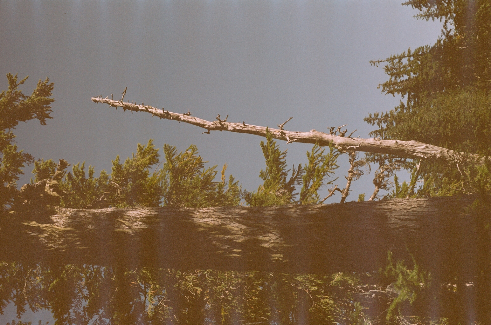
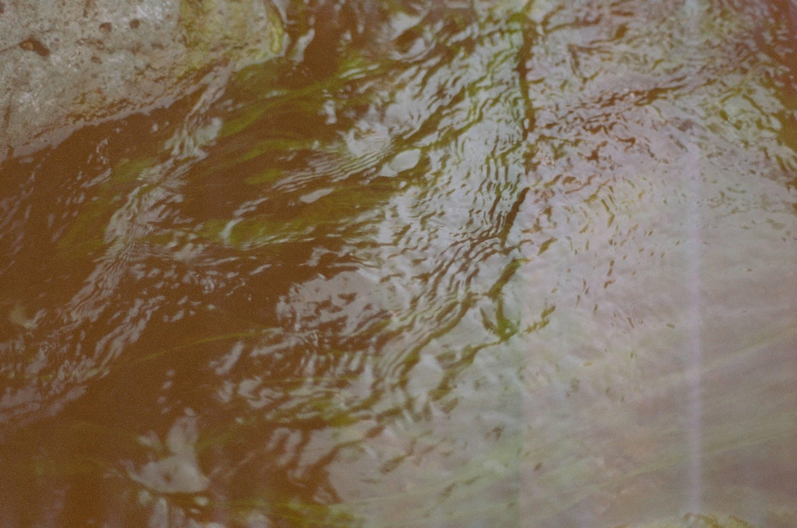

# August 2023 Leavenworth Film Shoot

The first part of this roll is the remainder of my Leavenworth vacation shots,
a few are from my back porch, and the rest are from a hike called Mount Forgotten.
For the most part, this roll was a dud, though I learned a lot, which I will explain
in a bit.

This was shot on some expired [^1] Kodak Gold 200 film. These rolls only have
24 exposures, which means you need to make the most of each shot. I did not do that.
I am starting to learn that you need to chose the right film stock for the things
you want to shoot: My current approach has been "buy whatever and see what happens",
but as I learn my camera better I need to be more mindful of the film I use. The
fact that this roll was expired makes it hard to guess what it would look like if
it was brand new, but alas.

Also, the bright artifacts have made a reappearence. At this point I believe that there
might be a light-leak in my camera. I find it odd that the first roll I did was fine,
but every one since that has been compromised. I need to finish the roll I have in
my camera currently, after which I'll probably send it in to get cleaned up and re-sealed.

Enough prelude, onto the pictures:

## 1-7

I tried to do some starlight photography, and that turned out to be a disaster.
All the pictures where blown out (the shop didn't even bother scanning it).
200 ISO is way too sensitive for what I was trying to do, and I was opening it for
way too long regardless. I assumed because it was pitch black out I could
leave the shutter open for longer, but I was proven wrong. This will be a challenge
for another day.

## 8

Probably the best picture of the whole roll. The expired film fits the overall look
of the scene, and the artifacts are hardly visible.

## 9

Here is where you start to see the artifacts. They are blue this time instead of white,
which I find interesting. My intuition would tell me that the picture itself would just
be brighter in that region, but instead it's bluer. Very odd.

## 10

Redacted because it's a picture of my sister and I haven't gotten her permission to
post it.

## 11

Another good one. The expired film makes the whole frame a bit greener, which ended up
looking decent.

## 12

Not a great picture: It's blury and out of focus, and the wall is way too blury, which
is only made worse by the artifact gremlins. The picture should've also been vertical
because the window is vertical, but oh well.

## 13

Another picture of my front door. I didn't stand still enough, so the whole picture is
a bit blury. The reason I took the picture (and the next few pictures from my porch) is
because a rain storm just came through, and there was this really pretty yellow sunset
outside. Either way, the expired film made it more green then yellow, which is annoying.

## 14

These next few are from my porch. The background was blury like I wanted it to be, but
the umbrella is not in focus at all (I have a hard time finding the right focus for close
up shots). Any attempt to have a good picture though was nullified by the artifacts.

## 15

This one was almost good, minus the artifacts.

## 16

This isn't very good, even without the artifacts.

## 17

## 18

This was at the top of Mount Forgotten. Since I only had a few shots left I went to the top
without taking any pictures, then took all my pictures on my way down. While the mountain
range overall was really pretty, there wasn't a single frame that looked really good given
the focal length of my camera.

## 19

A decent picture (minus the artifacts).

## 20

## 21

## 22

## 23

A not-so-good shot of a waterfall.

## 24

Some algae in this river. I didn't capture it very well, but perhaps someone more
experienced could have captured the dark river and the reflections at once.

## Fin

As I said, this roll was a bit of a dud. I got some good pictures, and learned a lot
on the way. Some of the big takeaways were:

* Make sure you're using the right film stock for what you're shooting.
* Take into account what the expired film will do to your shots.
* Stand still and focus better.
* I need to learn how to properly set the shutter speed and aperture for the more complicated shots.
* I need to figure out what is causing these light gremlins to get in my camera.

---

[^1]: I got it for free from a friend who got it from someone else, and it was out
of the box when he got it. It is at least a few years out of date, but it could be
much much longer, I have no idea.
