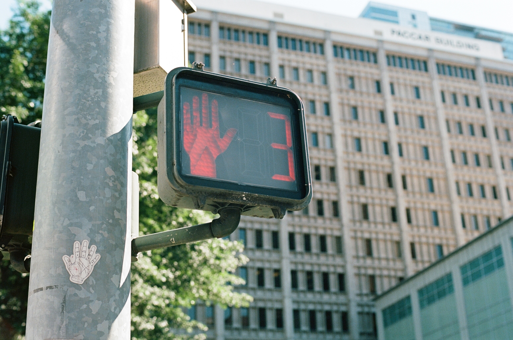
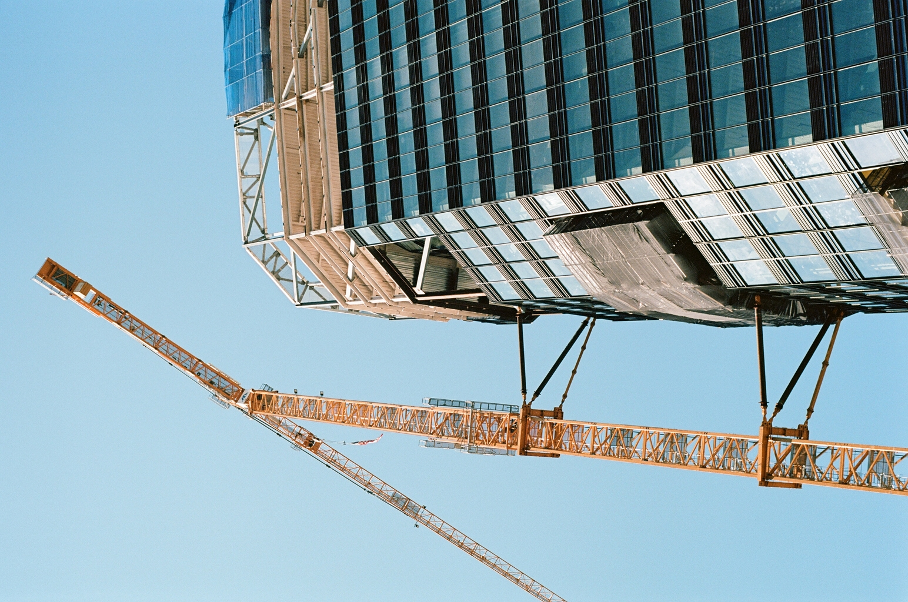
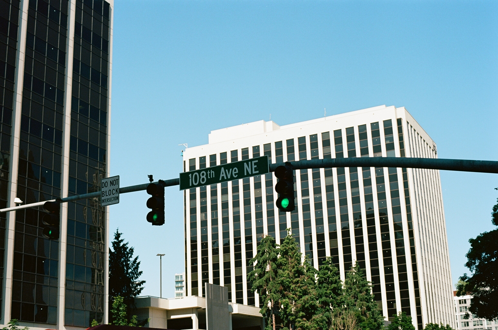
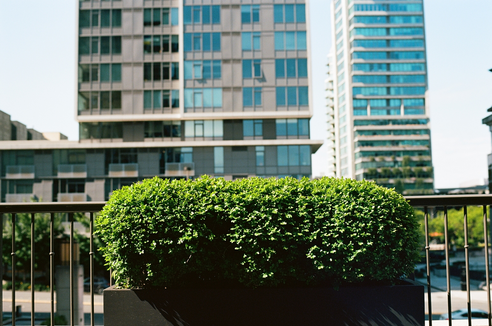
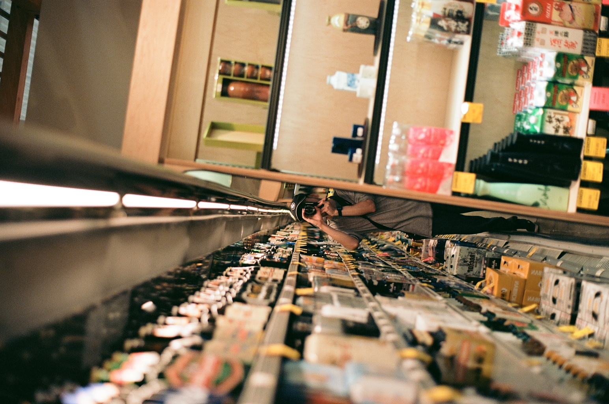
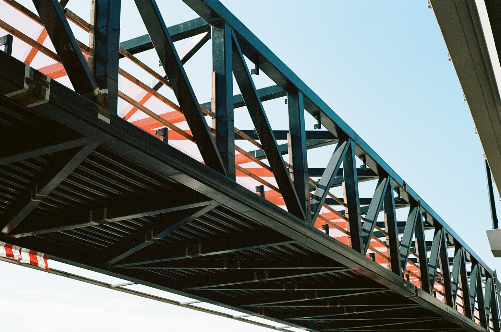
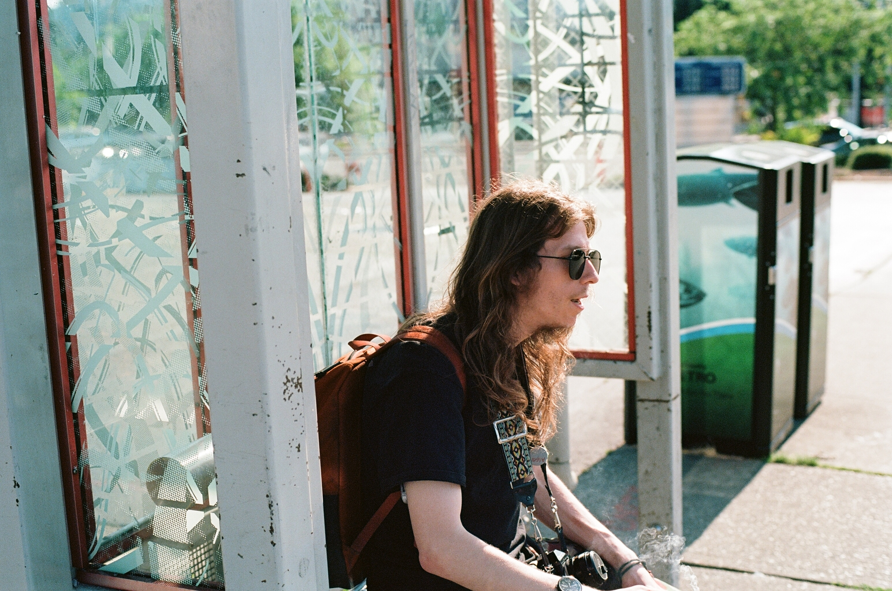
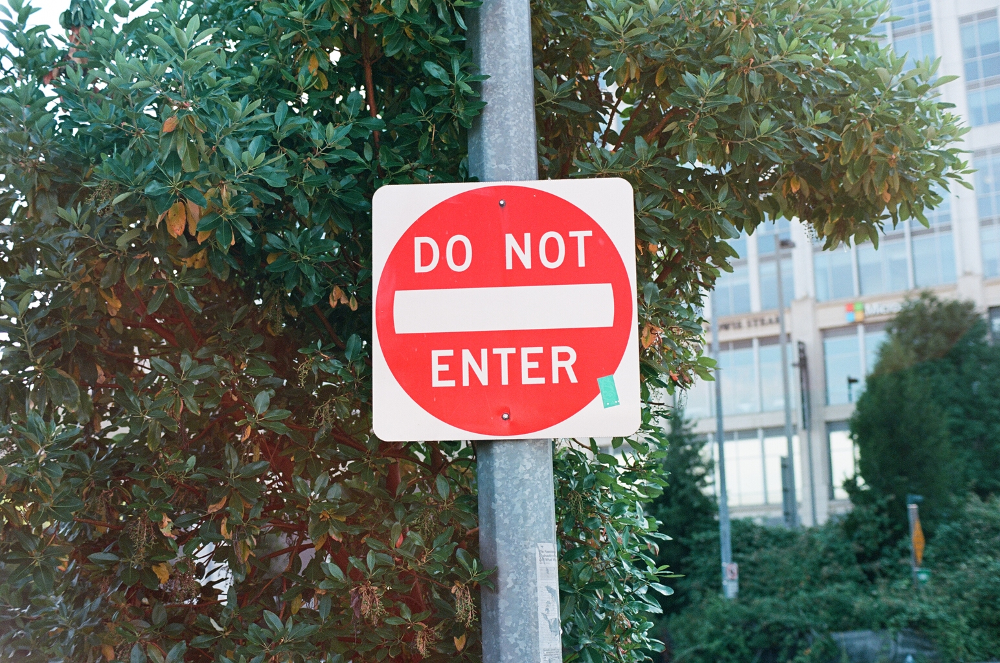
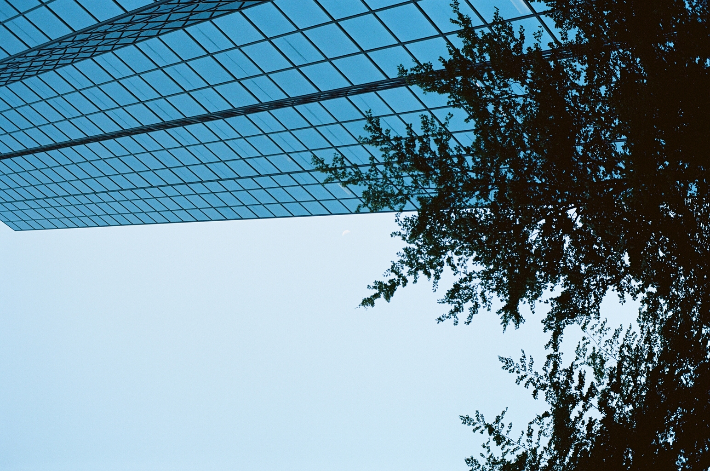

# July 2023 Bellevue Film Shoot

A few weeks ago me and my friend went to Bellevue to do some urban shots with our
film cameras. I am new to film photography, and was using a second-hand camera that
I got for free from a friend, so suffice to say, I had no idea what I was doing.

I've used a DSLR before, but have never used film. I basically put it into auto
mode, went shooting, and hoped for the best. Here's what I got.

Shooting with Ektar 100 color film. Images are downscaled to reduce bandwidth, and
to keep people from stealing my pictures.

## 1

A nice shot of a building with some cool, angular looking windows.

## 2

I liked the black and white parts of this building, and that it had very harsh sticky-out
bits. Also vines.

I took a whole lot of vertical shots because they kinda just felt right. Don't judge me.

## 3

Same as the last shot, but horizontal.

## 4

This looked a lot cooler in my head.

## 5

I like the vibe of this photo, but my poor friend is hard to see. Other than that I like it.

## 6

A lot going on in this one, but I like it.

## 7

I don't like this one.

## 8

I didn't notice until someone pointed it out, but there are 2 hands in this picture.

Also, I like the texture of the building in the background, reminds me of waffle shirts.

## 9

I don't know why I took this one, it's pointed up too high.

## 10

Better.

## 11

A very cool crane shot.

## 12

Not a great photo, but you can sorta see these ghost artifacts on the pole and
on the concrete. Very weird, very cool.

## 13

I love the wobbly glass panes in this one.

## 14

Some very nice looking bushes. The cars above are overexposed, but I don't mind.

## 15

Not a great picture, I just found it interesting that they would put numbers for
each floor on the outside.

## 16

A nice cross walk.

## 17

A very slanted picture of an intersection.

## 18

This was a cool construction site that caught my eye. I just now noticed that there is
a big lamp post in the right of the shot, but oh well.

## 19

There was road work happening all the way down this road, and about 10 signs all
lined up. If I moved a bit higher I probably could've gotten a few more signs.

## 20

Another bush. This is a very fancy bush in a fancy strip mall with vallet parking,
security guards, and high-end stores for luxury brands like Gucci. We didn't exactly
fit in.

## 21

More bushes, but near an escalator. This one accidentally lined up nicely with the
left edge of the frame, which was nice.

## 22

Still in the fancy strip mall. This one turned out great, I like the mix of curves and
straight lines.

## 23

Same construction site from before, but higher up. These porta-potties where sorta the
most eye-catching thing in the frame, so I just decided to make it them the star of the show.

## 24

We walked across the highway to go to Uwajimaya. Not a great shot, but I thought I would at least
take one highway shot.

## 25

This orange construction sign in the woods caught our eyes, so we went to check it out.
Not much to see.

## 26

A random potted plant in the corner of Uwajimaya. Didn't know how this one would turn out,
probably could've gotten a bit closer.

## 27

This was harder then it looks. There is less than a foot of space between the start of
the mirror and the shelves, so I couldn't get a lot of mirror without leaning way in
and making a fool of myself.

## 28

A curb outside of the store that looked cool.

## 29

My friend.

## 30

A cool pedestrian bridge that caught my eye. It turned out great.

## 31

My friend again.

## 32

An island of grass on an island of asphalt near a highway onramp.

## 33

A cool sign with some cool sepia tones.

## 34

The same shot as 19 but from across the street. I found it odd that there was this
one-story building on this little plot, surrounded by construction, and a skyline
backdrop behind that.

## 35

Looked better in my head.

## 36

The last one. Same position as 13 and 14.

## Fin

That's it! These pictures turned out a lot better than I expected, which means it
only goes downhill from here. Next time I need to go shooting in manual mode. My camera
did a great job in auto, but I need to figure out what shutter speed to use (I had my
apeture all the way open, so I might want to play with that as well).

 
