# July / August 2023 Black and White Shoot

This is the second roll of film I've ever shot, and this time round I wanted to shoot in
black and white [^1]. I'm still using the same camera from last time (an Olympus OM PC) but
this time I used Ilford XP2 Super 400 B&W film instead of Ektar 100.

Half of this roll is from 4th of July, a few are from around the house, and the rest are
from my vacation in Leavenworth. This will become very clear early on, but taking pictures
of fireworks - at night no less - was a mistake. I didn't have a good enough intuition for
what settings to use for the pictures I was taking, and I didn't hold the camera still enough
for the speed I was shooting at (which did lead to some interesting pictures). I was also
shooting in auto, so the light meter (understandably) wasn't able to account for the mix of
bright fireworks and dark skys.

Lastly, there are a lot of artifacts near where the holes are in the film. I don't know what
is causing this, though I suspect it is either the long exposure times, an issue with the
camera/film, or was an issue during development that caused it. My last roll had no such
artifacts, so I will need to do some experimentation to figure out what is causing this.

## 1

I accidentally took this one.

## 2

Same position as the last one, but I was actually ready to take it this time. I didn't hold
the camera still because I was squatting down to take this.

## 3

The first "good" picture in my opinion because there is actually something to look at.
The artifacts somewhat detract from it, but they do sort of give the picture
an eerie vibe to it.

## 4

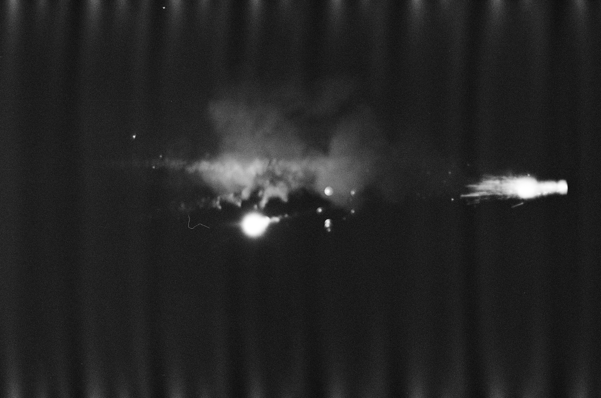

Out of focus.

## 5

This one would've been alright without all the artifacts.

## 6

Redacting this one because its a picture of my friends, and I haven't gotten explicit
permission to post it.

## 7

Somewhat interesting, slightly out of focus.

## 8

I liked the shape of the overhangs here, but the lighting didn't turn out how I wanted.

## 9

This was a cool picture. The bright spots are blown out and you can still see the trees,
so this probably should've been shot at a faster shutter speed.

## 10

This was shot at an even slower shutter speed than the last one so it's a bit blurrier.
Because I moved it there are these trails from the fireworks which are pretty cool.

## 11

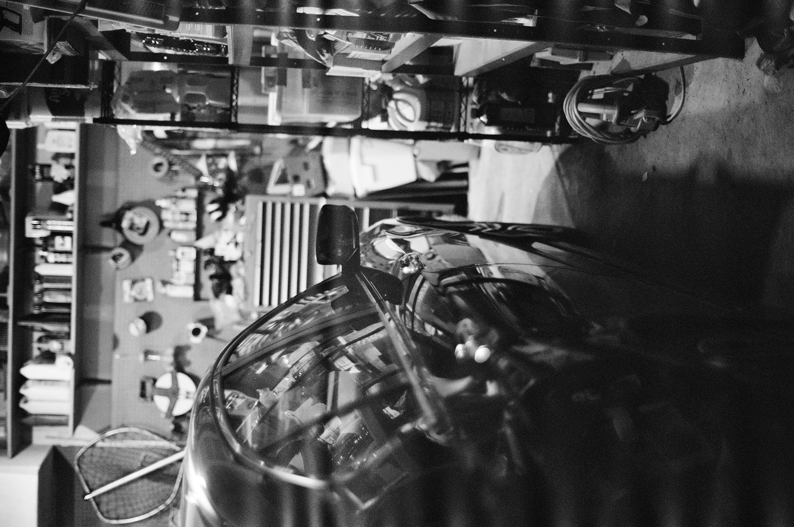

One of my favorites from this roll. I felt that this would turn out well because of all
the different objects and reflections, so I'm happy it turned out how I wanted it to.

## 12

We didn't shoot off any big fireworks, so I walked down to the road every once and a while
to get some pictures of the neighbors fireworks [^2]. When I did that I noticed a lot of
cars driving by with their brights on, and it created this really cool fog effect. Obviously
I didn't capture that very well.

## 13

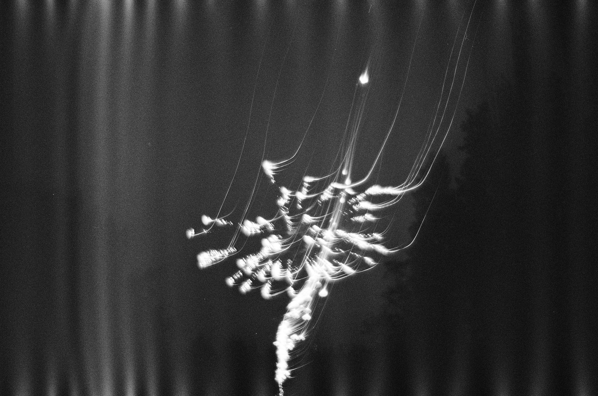

I distinctly remember taking this picture, lowering my camera, and then hearing the shutter
close. I thought the whole photo would be blown out, but instead I got these cool trails
instead.

## 14

This would've been better had it been a bit lower, and less exposed.

## 15

I wanted to capture both the light and the ferns, but if this was exposed any more the
light would've been blown out. Good to know for next time I guess.

## 16

This was taken in my friends car. It would've been ok if the artifacts weren't there.
Also, this probably would've been better in color.

## 17

Kinda boring.

## 18

I tried taking a picture of a firework from inside the car, but it didn't turn out
great.

## 19

I like the fog in this one, but everything is blury because the car was moving.

This was the last 4th of July picture.

## 20

This actually turned out decent. I took it at around noon, so the lighting was good
and the shadows provided a decent amount of contrast. I should've made the shadows/railing
more front-and-center, but I like it how it is.

## 21

My front door. This would be better in color because all the glass segments make little
rainbows and refractions that don't come across very well on B&W.

## 22

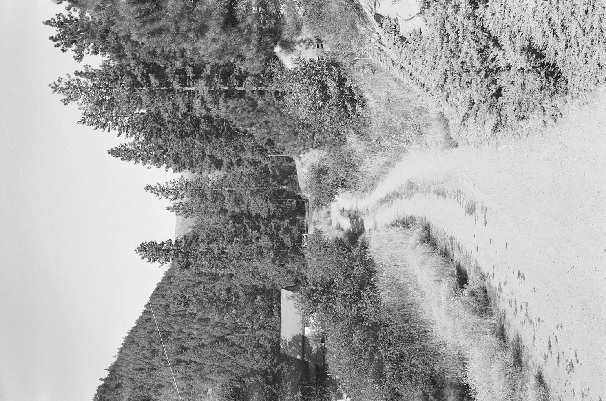

This is the view from our Airbnb in Leavenworth. It's a bit over exposed, but overall I
like it. I do find it odd that the powerlines are white not gray/black.

## 23

The rest of this roll is a hike we went on in Leavenworth. This one turned out great, all
the little leaves make a really nice pattern.

## 24

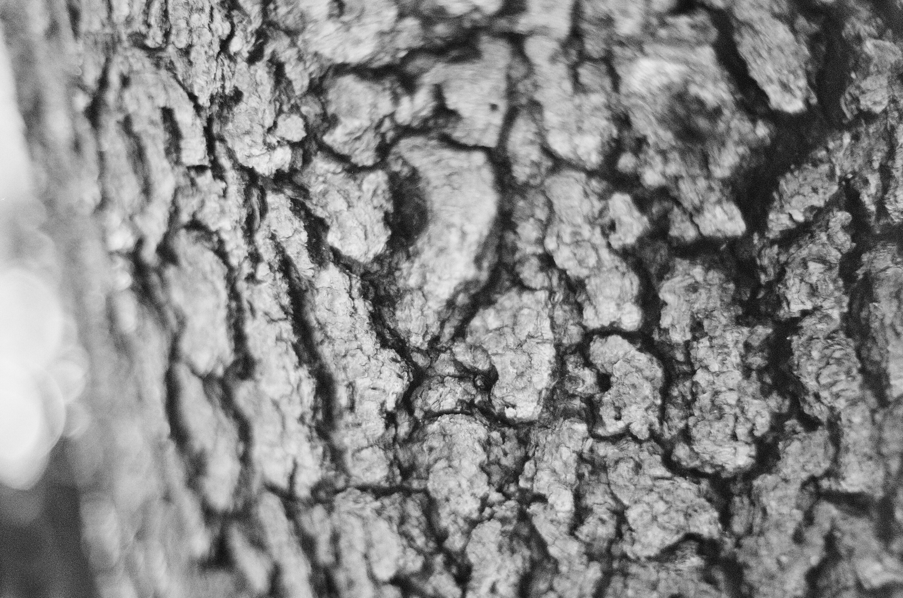

I was trying to capture the texture of the bark, but it didn't turn out how I expected it.
What is weird is that there is this radial blur around the edges, and I guess that's because
I was focused on only the center. I haven't taken a lot of up-close pictures yet, so this
will be something to keep in mind.

## 25

This was another one where color would've been nice. The wavy parts of the rocks had a nice
brown/gray/white color to it, though that didn't really come across well.

## 26

This one is alright, minus the artifacts on the bottom.

## 27

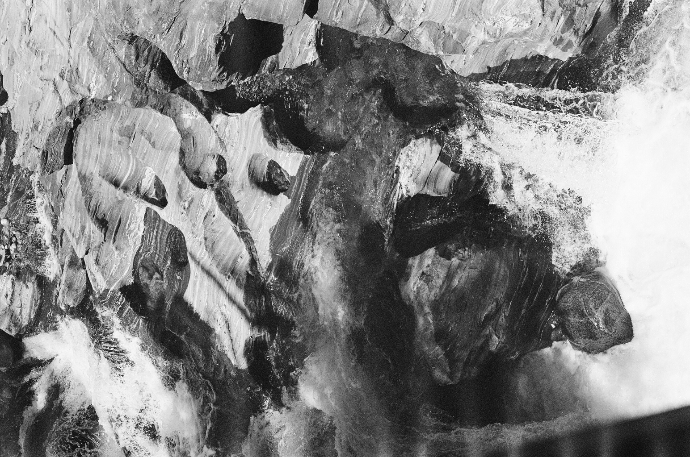

I really like this one. This looks much better because of the errosion of the rocks and the
spray of the waterfalls.

## 28

Over exposed and a bit blury.

## 29

This turned out decent. The bridge itself was a rusty color which was nice, but the form
itself was what I liked the most.

## 30

A different view of the same bridge. I spent about a minute lining up the shot and
getting the right focus, then this other hiker walked right into the frame last second.
It isn't super noticeable, but I usually prefer to not have people in my shots unless they're
the subjects.

## 31

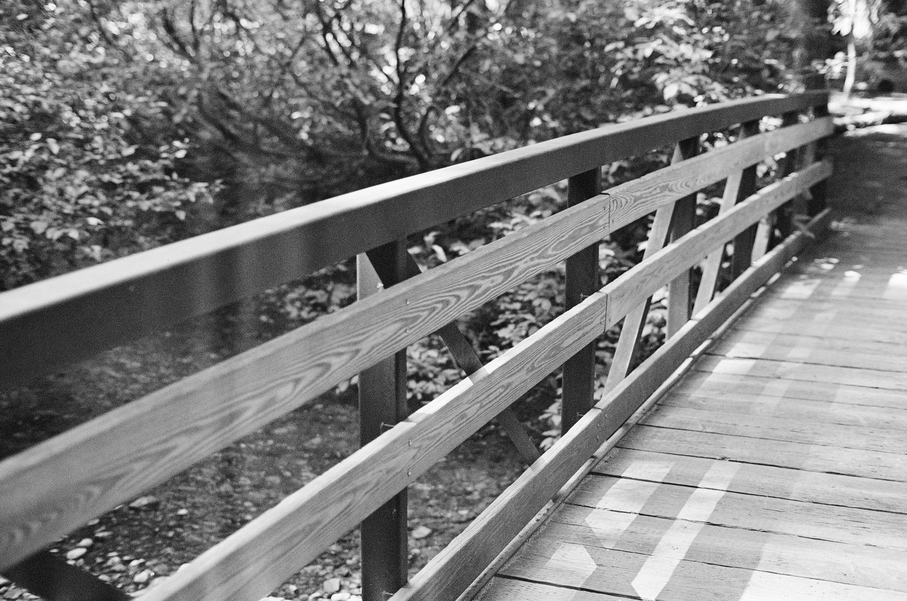

A different bridge, not as interesting though.

## 32

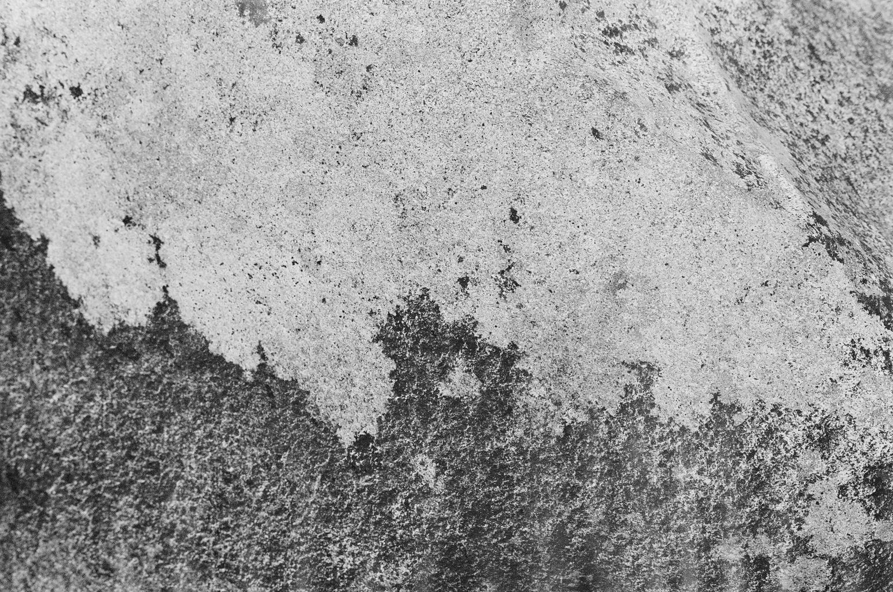

I liked the texture of this rock, but I don't think it was worth a picture.

## 33

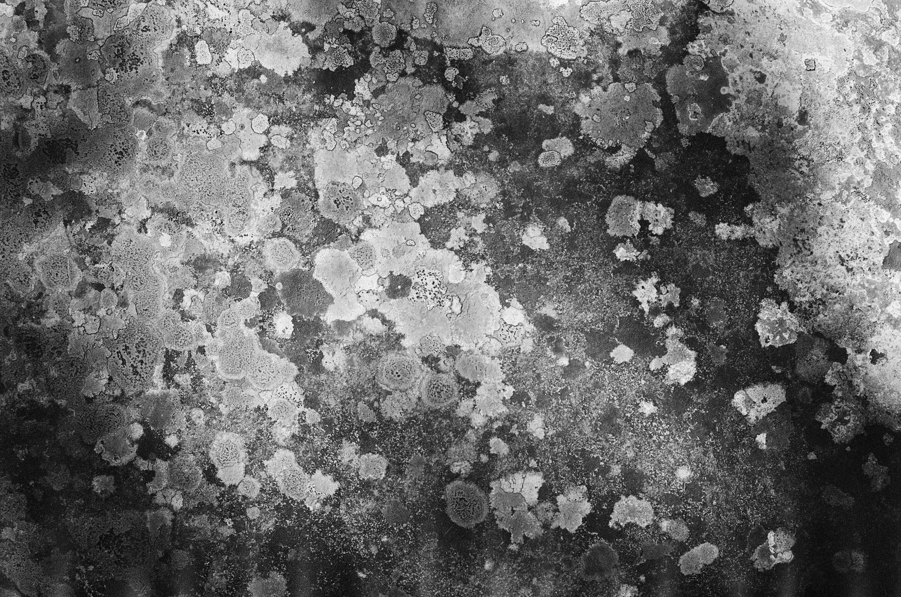

Another rock picture. This rock looked kinda cool because it was black and grey,
and had this green moss/fungus stuff on it, though that doesn't translate well to B&W.

## 34

This is probably my favorite one from the whole roll. Near the end of the hike there was
this access road that had this metal sign, and someone had shot at it for whatever reason.
On the back side of the sign the paint shattered and formed these spiderweb looking patterns.
While I really like this one I wish I had taken a picture of it in color, because the paint
on the sign was yellow, which really popped out in person. Still, a great picture.

## 35

A nice, well lit river. The mountains are also perfect in this one.

## 36

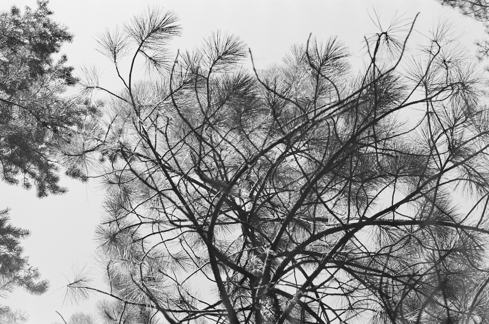

These really pointy needles on this tree caught my eye. It would've probably been better
in color, but I still like the overall form.

## 37

I saw these really bendy trees and really wanted to take a picture of them. The trail itself
was also bendy, and I wish I had a wider lense so that I could've gotten the whole trail
including the trees, but I could only get the trees.

## 38

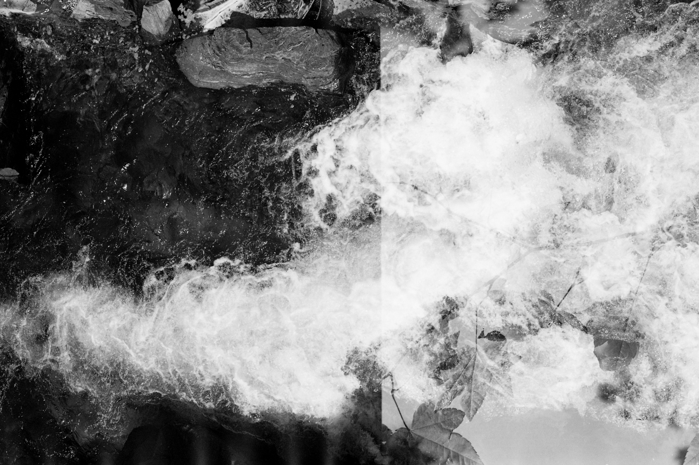

These last 2 were weird. Given that this roll is supposed to have 36 exposures, trying to
get 39 exposures was pushing things a bit too far. If I had just done 38 things would've
been fine, but I tried to go for 39 and the camera could not advance any more, so part
of the frame was reused.

## 39

These leaves turned out really nice, minus the waterfall from the last frame.

## 38 1/2

I combined the last 2 frames into one, which creates these 3 distinct yet similar segments.

This is why I love film so much. Every picture is a mystery until you get it developed, and
even when you do, you never know what you're gonna get.

## Final Notes

This roll didn't turn out how I expected, and I have a lot to learn. I need to figure out
why these artifacts are popping up (could just be a development issue), I need to get
familiar with manually setting the shutter speed, and I need to invest in a small tripod
for some of my longer exposure shots.

In general, I've learned that nature shots (normally) don't make for good B&W pictures,
but there are certain times where B&W makes a lot of sense. Since I don't have the luxury
of having 2 film cameras, I need to make sure when I'm shooting B&W that I have lots of
subjects I can take pictures of that will work well with the film I have loaded. This is more
of a planning issue, but a skill I need to learn nonetheless.

---

[^1]: I originally wanted to get into film because I wanted to do B&W, but was talked into
starting off with color. I'm glad I did because B&W is hard, and starting off with color
helped me learn my camera a bit more.

[^2]: I should say my friends neighbors, since I was at a friends house.
