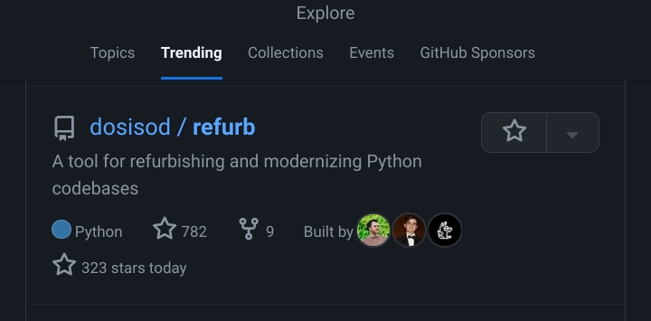
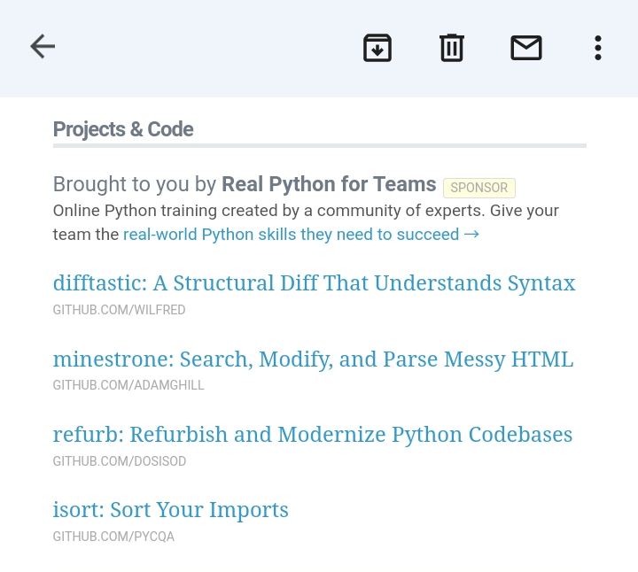

# Refurb: Launch Retrospective

It has been about 4 months since the initial commit of my [Refurb](https://github.com/dosisod/refurb) project.
Since then, the project has gotten:

* 1.8k stars
* 5 new contributors
* Hundreds of unique visitors each day

How did my little side project go from nothing to where it is today? How did I launch this
project, and what would I have done differently if I was to launch it again?

> Note that this is just a recount of my experiences with this one project. If you follow my steps
> exactly, you likely will not end up in the same spot. In addition, I would contribute a lot of this
> project's success to factors outside of my control, things like the spontaneity of the internet,
> GitHub's "trending" algorithm, and so on.

Here is a timeline of events, starting with the initial commit.

## July 26th, 2022

On July 26th I made my first commit for my Refurb project. I had no idea where it was going to
go at first. What I did know was that I wanted to make a linter that would detect code smells
and other common issues that I would often find during doing code reviews. No tool that I knew
of could do what I was looking for, so I did what any engineer would do and built my own tool!

I chose to build everything off of [Mypy](https://github.com/python/mypy), since I was somewhat
familiar with it (I had been using it for years), and knew that it was one of the more mature type checkers
out there. Because Refurb was going to rely heavily on type information, I wanted to make sure I have
the most type-rich AST available to me. I feel like I made the right choice in that regard.

## August 6th, 2022 (Day 11)

11 days later, I published [Refurb v0.1.0](https://pypi.org/project/refurb/0.1.0/) to PyPi. Although
this was not a major release by any means, this was the first time I had ever published a package
to PyPi. I felt like it was good enough to put out into the world, even if nobody was going to use it
right away. This somewhat forced me to work on it more, because I was exposing this project more by
putting it out there on PyPi (and I really didn't want this to become another project I was just going
to abandon).

## September 18th, 2022 (Day 54)

A lot happened since the last milestone. By this point in time, I had written 28 checks, and felt
that Refurb was in a good position for the all important v1 release. At this point, I started to make
user orientated changes such as:

* Ensuring that Refurb was able to be installed correctly by end users
* Polishing up the plugin system
* Adding more documentation to the README
* Adding inline comments

And lots of bug fixes. By the end of this, I was happy with Refurb, and ready to show it to the world.

## September 27th, 2022 (Day 63)

Two months after the initial commit, I published v1 of Refurb to PyPi, and posted a [launch Hacker News post](https://news.ycombinator.com/item?id=33003929)
about it. I posted it at 7:27PM, and within 2 hours, it was on the trending page [^1]:

I was ecstatic! Every morning I look at Hacker News to see what is going on in the tech world (I don't use
Twitter/Facebook/Instagram), so to see myself on Hacker News was exciting.

I responded to a few comments, and then I went to bed.

## September 28th, 2022

When I woke up, I immediately checked Hacker News again, and was surprised to see that I was still on
the trending page. I had gotten a lot of comments, and I spent the whole day responding to people's
questions, bug reports, and so forth. By the end of the day, I had merged in 4 PR's, one of them
being the addition of a `--help` flag (which I embarrassingly forgot).

All in all, the launch went better then expected. There where some oversights on my part, but they
were mitigated quickly.

## The Aftermath

A couple days later, I ended up on GitHub Trending:

Then, about a week later, I saw my project on the [Real Python](https://realpython.com/) newsletter:

As well as a lot of other places, according to the GitHub traffic section [^2]:

This project that I built for myself ended up resonating with a lot of people, it would seem.
I couldn't've asked for a better outcome! Because of the explosion in people using my projects,
I decided to setup a [GitHub Sponsorship](https://github.com/sponsors/dosisod) profile so that
people can sponsor me if they so desire.

## Conclusion

All in all, I wouldn't change a whole lot about the launch. Despite there being a few things which
I would've done differently, for the most part, everything went over really smoothly.

For people looking for advice on how to emulate my success, I would tell you to work on things which
excite you, to work on things you know will be valuable to someone, most importantly yourself. Try
and get an MVP up and running as soon as possible, and ask yourself after every commit whether you
are getting closer or farther from your goals (whatever those may be).

---

[^1]: I am not sure exactly how the Hacker News trending algorithm works, but, I assume that
it is pretty easy to get onto the trending page, the hard part is staying on the trending
page for a long time.

[^2]: Just go to "Insights" > "Traffic" on the top bar of any repo you own! It super interesting
to see how people are finding out about your project. Also, it is hard to say for certain, but I
think these stats are only from the past week. I don't think there is a way to see prior stats.
