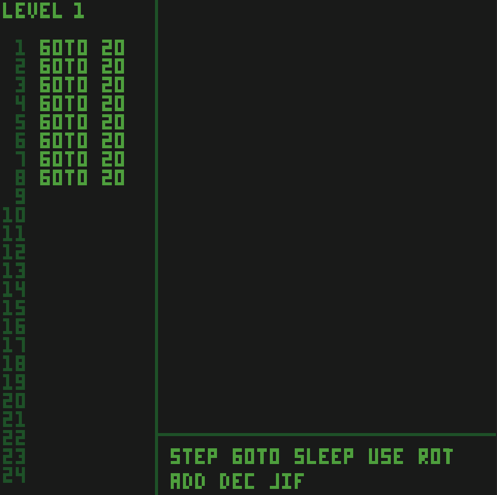

# WASM-4 Game Jam: Day 1

The second [WASM-4](https://wasm4.org/) game jam is [going on right now](https://itch.io/jam/wasm4-v2)!
I missed out last year due to COVID, but this year I am determined to finish.
Hopefully by writing a little blog about it every day I will force myself to follow through.

## Intro

From the [WASM-4](https://wasm4.org/) website:

> Build retro games using WebAssembly for a fantasy console

By "fantasy console" they mean a console with 4 color 160x160 pixel screen, 64KB of memory, and 1KB of storage.
And you have to build it using WebAssembly, or something that compiles to WebAssembly (C, C++, Rust, etc.).

I love the contrast of using a bleeding edge technology like WebAssembly to build retro games.
The WASM-4 people make it super easy to get started, and you don't even need any WebAssembly
experience to make something awesome.

## Brainstorming

There doesn't seem to be a theme like there was last year, so I'm just coming up with something on
my own. I really wanted to make a rouge-like/Minecraft/Terraria clone of sorts, and then it hit me:
They recently added [multiplayer functionality](https://wasm4.org/blog/release-2-4-0), and my initial
thoughts where that I could somehow link 4 instances together, effectively quadrupling my memory and
storage.

Turns out that they all share the same memory, and saving/reading from disk is not allowed when network
sharing is enabled. Then I decided that making a high quality rouge-like with world generation would
probably be too hard, especially given my game dev skills are pretty rusty.

In general, the thought of building an actual world for my game made me anxious. Maybe this was
all a mistake.

But then it hit me: What if I incorporated some sort of programming element to my games? I like
compilers/programming languages [^1], so this would be something I could do really well.

## An Idea Emerges

I can't exactly create a full-blown programming language. Ok, I could, but you don't have a keyboard.
What you do have is a D-PAD, 2 buttons... and a mouse! Drag and drop FTW!

So basically I am creating a drag and drop editor which allows you to plop down code blocks
to move your player around a game board, avoiding enemies, following objectives, and so on. The
language itself will be an assembly-like language [^2] to fit with the retro theme.

## Progress

This is what I have so far:

I plan on changing the color scheme, actually adding the game logic, adding music, adding the IDE
features, etc etc. I am happy with what I have so far.

## Where is the code?

The code is a steaming pile of garbage, and is unreleasable in its current state [^3]. I will
have released it before the game jam is over though, regardless of how messy it is.

## Name?

My creation doesn't have a name yet. That comes later. Maybe.

---

[^1]: See [Skull](https://github.com/dosisod/skull),
[Write a Compiler](https://github.com/dosisod/write-a-compiler),
and [Refurb](https://github.com/dosisod/refurb).

[^2]: I just realize how meta it is to make make up an *assembly* language for a game jam
that revolves around Web*Assembly*. No complaints.

[^3]: It probably isn't *that* bad, but I know it can be better, a lot better.
