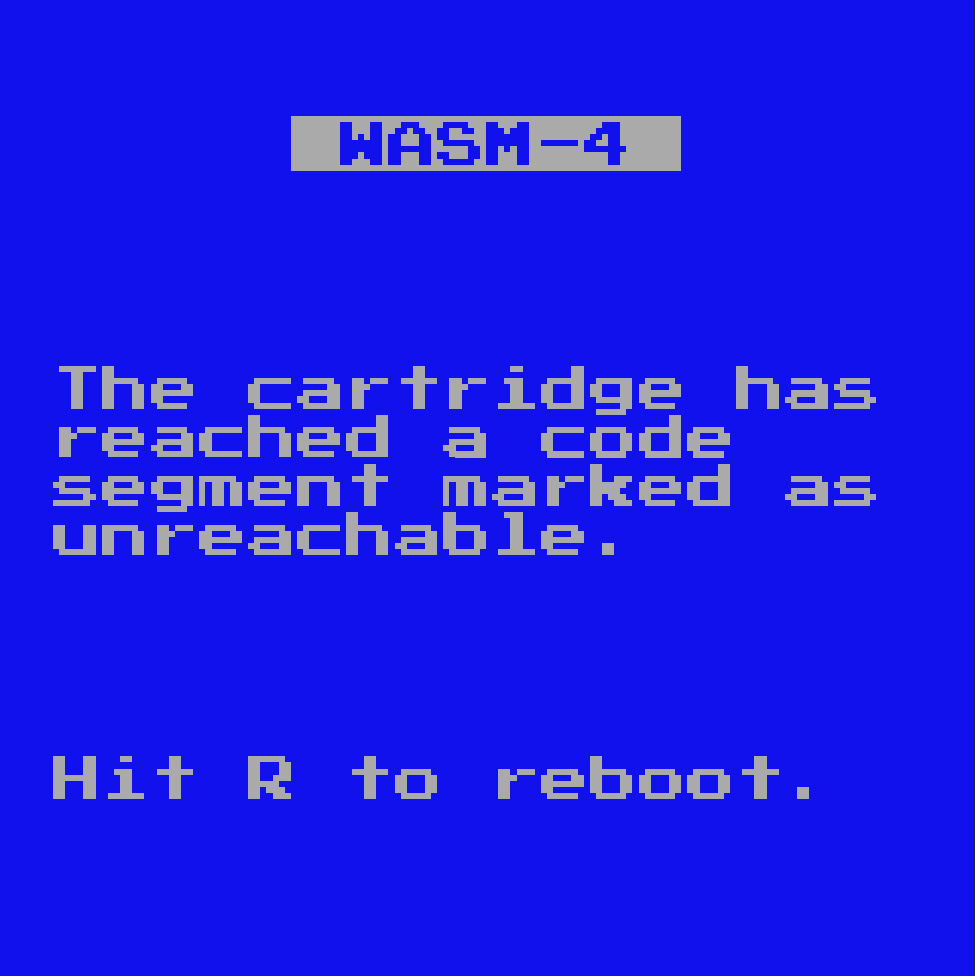

# WASM-4 Game Jam: Day 10

Today was the last day of the WASM-4 game jam! I was planning on writing a blog
yesterday, but got frazzled with some things which I will get to later.

All in all, I had a good time, despite the last couple hours before the deadline
being a bit stressful. Even after the deadline there was chaos: Many people, myself
included, did not upload to Itch in time. This year, there where 2 places you needed
to upload to: [WAPM](https://wapm.io/interface/wasm4) and [itch.io](https://itch.io/jam/wasm4-v2).
There was not a whole lot of clarity as to which one you where supposed to upload
to (perhaps it was assumed you where supposed to upload to both?). It seems like
WAPM is the one sponsoring the event, but Itch is where the content will actually be judged/viewed.
Next year I hope the process for uploading will be a bit more clear.

Anyways, in the final hours of the jam, I tried to add a few new levels, only to run into
memory errors:




This was due to my poorly optimized program hogging up too much memory. Why was it
hogging up too much memory? Good question: I really don't know. I tried to profile
it, but since it only occupies one page of memory (64KB), I have no good way of
tracking the memory usage of my program over time [^1].

The next step would be to inspect the most commonly used elements of my game, and
see how much memory it is using.

Here is the code for the `Item` class:

```typescript
export class Item {
  kind: ItemType;
  pos: Position2;
  disabled: boolean = false;
  action: ((lvl: Level, item: Item) => void) | null = null;
};
```

We can use the following to get the offset of each field, and see if we can slim it down:

```typescript
w4.trace(offsetof<Item>("kind").toString());
w4.trace(offsetof<Item>("pos").toString());
w4.trace(offsetof<Item>("disabled").toString());
w4.trace(offsetof<Item>("action").toString());
```

And this is the output we get in the console:

```
0
4
8
12
```

What? Well, as it turns out, each field will allocate 4 bytes (32 bits), which is what
we are seeing here. Even if it is a `boolean` (1 bit!), a full 32 bits will be taken up.
This is super wasteful, and I couldn't find an easy way to pack the class
other then bit shifting the data myself (which I didn't have time for this level
of optimization).

Another issue was that I had no idea what data was being stored on the read-only portion of
the cart, and what was being stored on the heap. I assumed that the memory I had declared as
`const` would somehow be shoved into this read only memory, but that would not appear to be
the case. What I probably needed to do was something like this:

```typescript
memory.data<Item>([{
  kind: ItemType.COIN,
  pos: { x: 1, y: 2, rot: Direction.NORTH },
}]);
```

Which would actually make sense.

I tried some flags such as `--optimizeLevel` and `--shrinkLevel`, but this only seemed to
improve the static memory allocation, not the heap allocated memory.

Last minute bug fixes are not fun.

## In Short

I wish I had spent some time playing around with AssemblyScript before committing to using
it in a full game. I like AssemblyScript, but I used it wrong, and some preparation could've
prevented that.

I am proud of the work that I produced, and it was nice to have a deadline where I had
to produce a certain result, but in a creative and open-ended fashion. I am excited to
play all of the submitted games.

Most of all though, I am curious to see the cool coding techniques that people employed to
get their memory usage to a minimum, what languages where used, and so forth.

---

[^1]: That is, if I use the [`memory.size()`](https://www.assemblyscript.org/stdlib/globals.html#memory)
function to track how many pages are currently in use. There might be a way to
track the memory usage within a page, though I could not find something similar to that.
