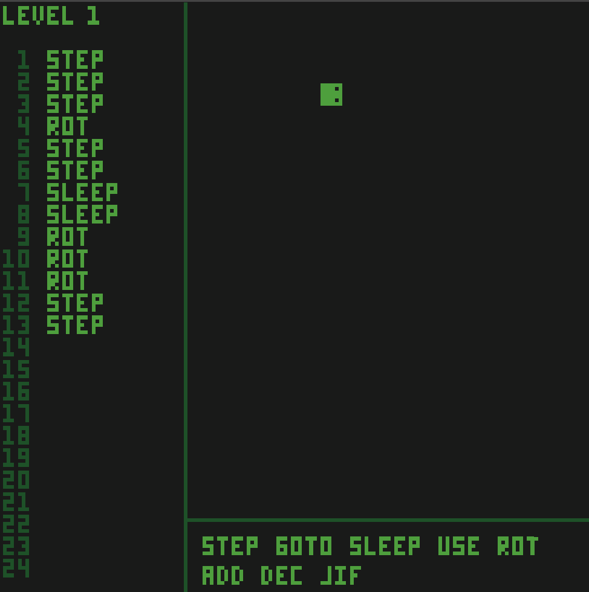

# WASM-4 Game Jam: Day 2

Most of the work I did today was sprite and level design, of which I don't have a
lot to show. In terms of coding, I added the ability to click on an instruction
on the right, have it appear on the left side with the other instructions, and
have the player move in response.

## Pics

## Next Steps

Right now the instructions are ran as soon as you click them, but I will need to
change that so that it is constantly running in a loop. Also, I need to spruce up
the UI, make some basic sounds for certain events/interactions, and actual drag
and drop for everything. I will also need to allow for deleting and moving
instructions around.
