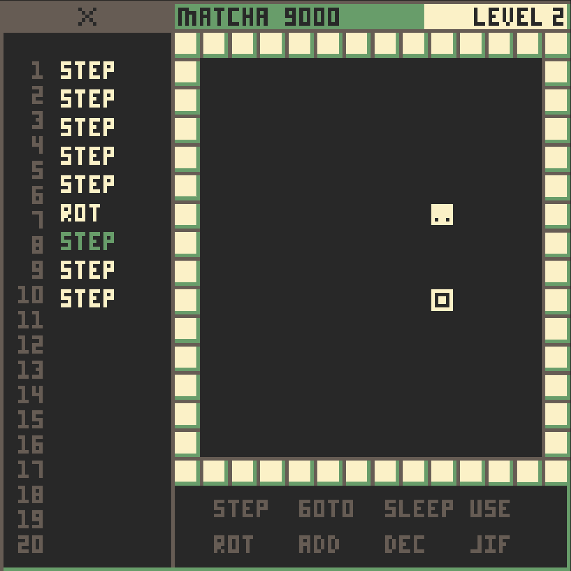

# WASM-4 Game Jam: Day 3

Today was great! Among other things, I:

* Landed on a good color scheme [^1]
* Named it "Matcha 9000" [^2]
* Added basic level rendering
* Added the CPU queuing logic

> Note that the `x`'d out section at the top is covering up what will be the
> accumulator display, which will be unlocked at a later level. It looks out
> of place right now, but it will look a lot better when the operators in the
> bottom right are locked as well.

## Tomorrow

Tomorrow I am (hopefully) going to spruce everything up, add some actual levels,
some background music, dialogue boxes, and more!

---

[^1]: I basically just ripped the colors from [Gruvbox](https://github.com/morhetz/gruvbox),
my favorite color scheme.

[^2]: Matcha is a type of green tea, which happens to go great with the green/aqua
color scheme. The "9000" is added because I can.
