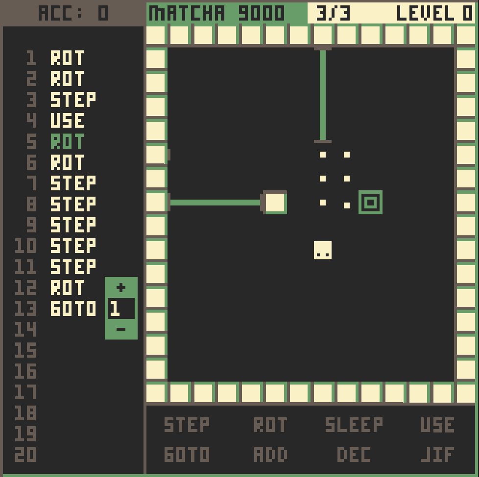

# WASM-4 Game Jam: Day 5

I've made more progress today then any other day so far! Things are starting to all come
together, and *now* I am at the point where I can actually start building some really
cool levels.

Some of the things I did today:

* Make lasers actually kill you
* Allow for buttons to disable lasers
* Add a cool wavy coin animation
* Add the display for the accumulator
* Add menu with `+`/`-` buttons for the op codes that have an argument
* Add sound!

The sounds where a lot easier to add then I anticipated, and I feel like I could add
in a few more sounds here really quickly.

## Proof

> Level 0 is my testing/development level. It also acts as a buffer to allow my to use
> 1-based indexing for the levels array :)

Tomorrow I hope to upload my code so far to GitHub. It is as good as it is going to
be (cleanliness-wise), no point in trying to clean it up more. Maybe after the game
jam I will.
